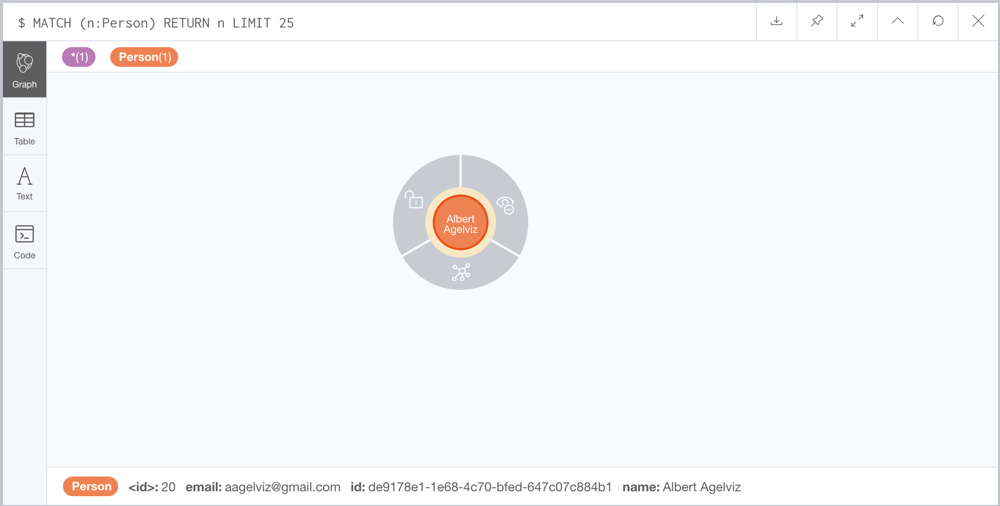
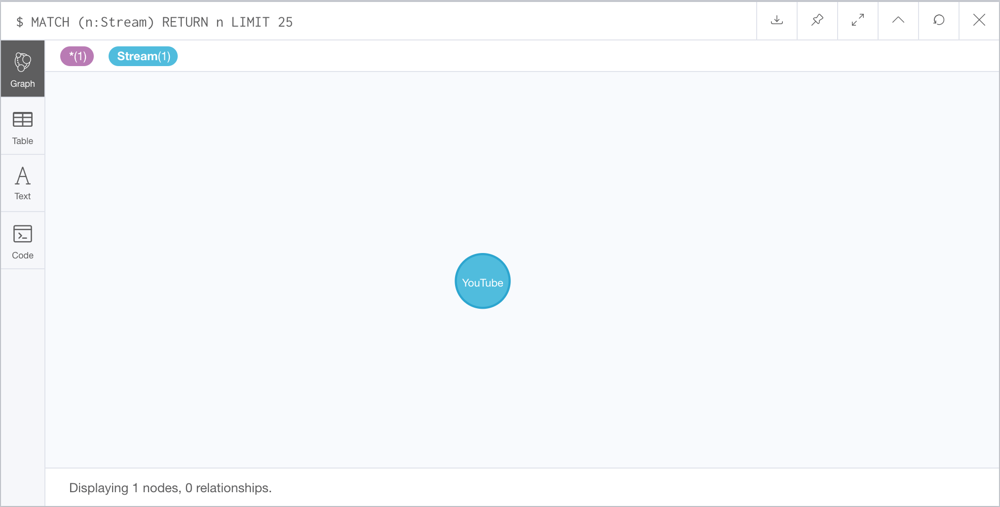
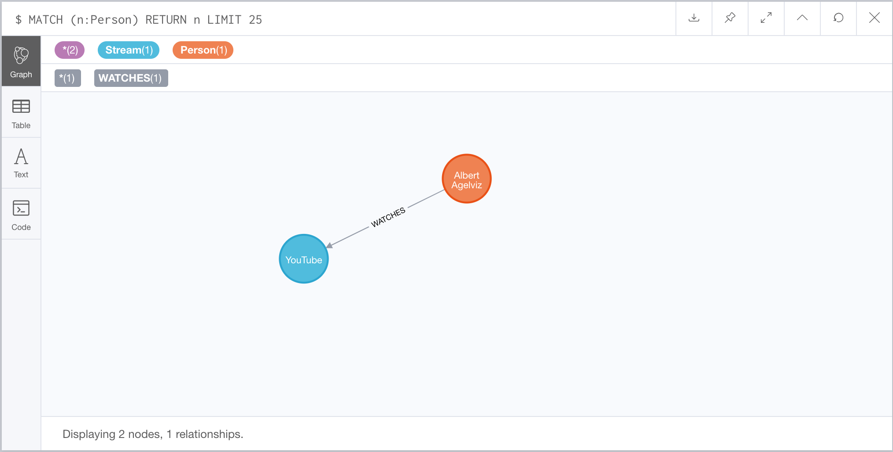
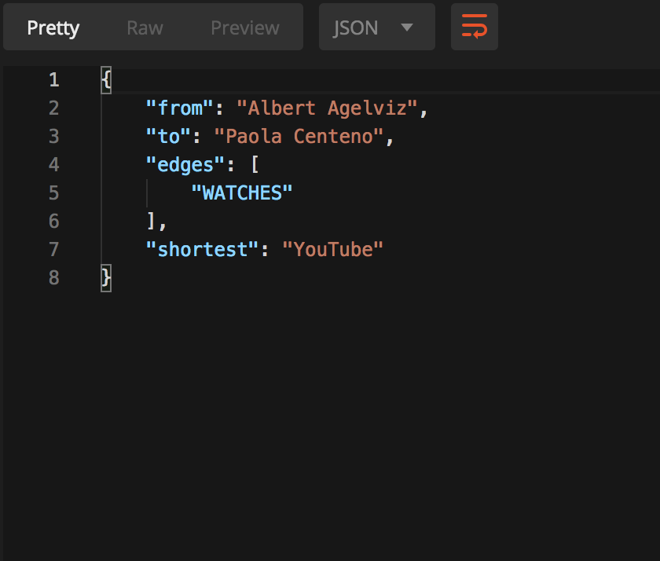
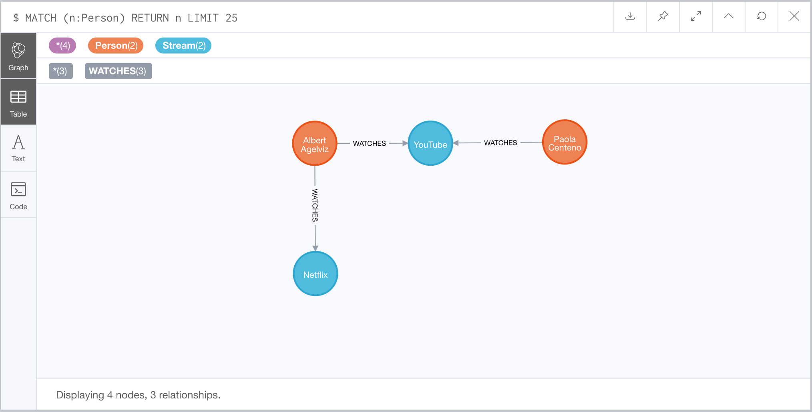

# Node Edge Graph API
===============

Welcome to Node Edge Graph, this app is an API application whose purpose is to deal with the graph theory.

## Table of Contents
* [Requirements](#requirements)
* [Installation](#installation)
* [Usage](#usage)
    * [Adding a PERSON](#adding-a-person)
    * [Adding a STREAM](#adding-a-stream)
    * [Adding a STREAM to a PERSON](#adding-a-stream-to-a-person)
    * [Checking shortest path of PERSON to NODE](#checking-shortest-path-of-person-to-node)
* [Tests](#tests)

## Requirements
- To be able to use this application, [Docker](https://www.docker.com/) is required
- [Postman](https://www.getpostman.com/) (recommended)

## Installation
To install the application, clone this repo, cd to the folder, and run **make start**

## Usage
Once the application is running you can interact with:
- Postman: go to your postman and import the [Collection](./api-postman.json).
- CURL: go to the api docs and check the API documentation

### Adding a PERSON
Once you hit the endpoint(**api/persons**) and add a new person, go to [Neo](http://127.0.0.1:7474/browser/) and check the node

### Adding a STREAM
Once you hit the endpoint(**api/streams**) and add a new stream, go to [Neo](http://127.0.0.1:7474/browser/) and check the node

### Adding a STREAM to a PERSON
Once you hit the endpoint(**api/persons/{personID}/streams**) and add a new stream to a person, go to [Neo](http://127.0.0.1:7474/browser/) and check the relation

### Checking shortest path of PERSON to NODE
You can check either by API, just GET (**api/persons/{personID}/path?person={personID}**) and check the response:

Or you can go to [Neo](http://127.0.0.1:7474/browser/) and check the UI:

## Tests
If you want to run tests of this application, run the following command: **make test**
